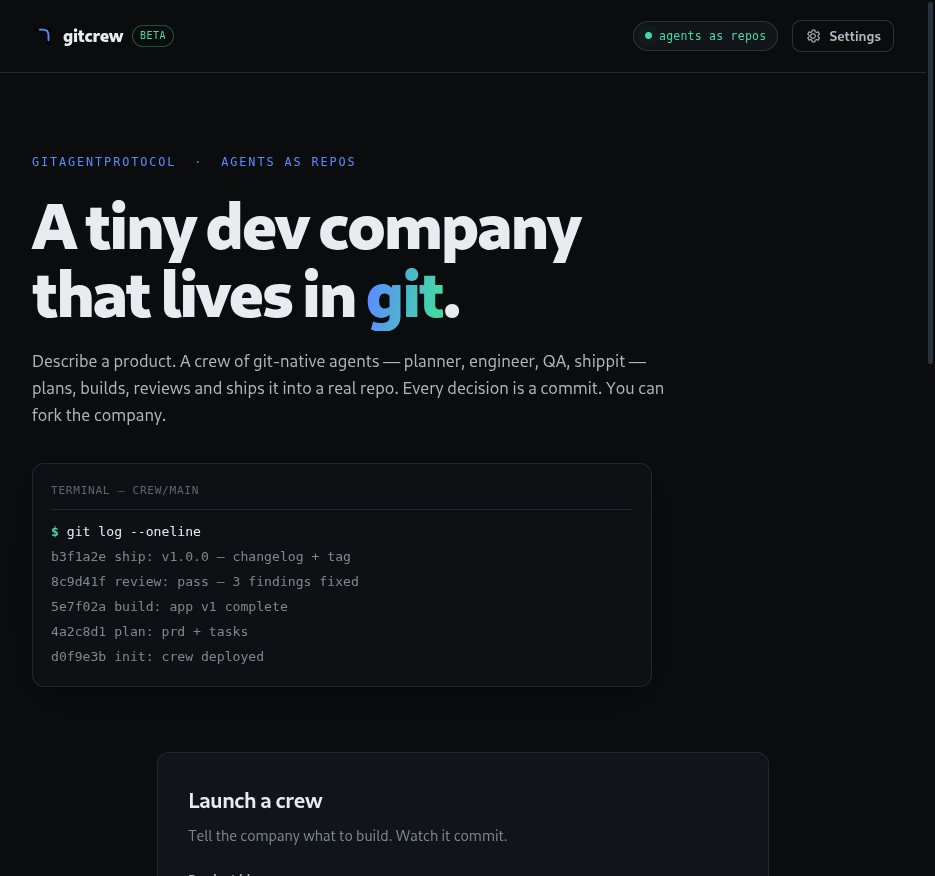
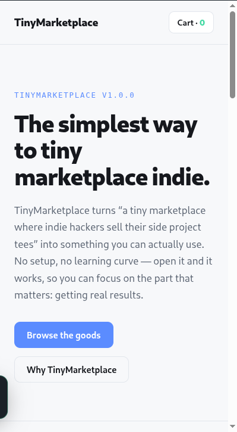

# gitcrew — design notes

## Product concept

Most "AI app builders" generate a file and call it done. `gitcrew` sells a
different, framework-shaped idea: **the dev company itself is the artifact.**
The build output isn't just a product — it's a git repo containing the
company that built it (its soul, rules, memory, specialists, workflow), plus
the product, all with real history. You can fork the company.

This is exactly what GitAgentProtocol (GAP) is designed for, and the product
was built to make that visible rather than hiding it.

## Agent design (crew-template/)

The template is a standalone git repo (`crew-template/.git`). Key decisions:

- **Sub-agents as repos**: each specialist (`agents/<role>/`) has its own
  `agent.yaml` + `SOUL.md`, mirroring the top-level company manifest. GAP's
  "agents as repos" nesting.
- **The product IS the company repo.** On deploy we copy the template, `git
  init`, and commit `init: crew deployed for "…"`. From then on, everything —
  plans, code, memory — lands in the same repo with a linear, readable story.
- **Skills encode phases**: `skills/{plan,build,review,ship}/SKILL.md` are
  what the live agent actually executes; `workflows/build.yaml` documents the
  same pipeline declaratively.
- **Declarative tools with real effects**: `tools/commit.yaml` and
  `tools/checkpoint.yaml` are auto-loaded by the SDK from the repo — so the
  agent's own tool calls produce the git commits and memory commits that the
  UI streams.
- **Hooks**: `hooks/hooks.yaml` runs a `pre_tool_use` script that appends to
  `.gitagent/hooks.log` — a native audit trail, written to the repo (and
  gitignored, so it never pollutes the story).
- **Knowledge**: `knowledge/PRODUCT_PLAYBOOK.md` is the design system the
  engineer must obey — a concrete use of GAP's knowledge entries.

## Orchestration

A sequential multi-agent pipeline (CrewAI-style "process"):

1. Server deploys the workspace (copy template → git init → seed brief).
2. For each of 5 phases, one `query()` runs against the repo with a composed
   system prompt (sub-agent SOUL + company RULES + phase skill + playbook).
3. The SDK streams `delta` / `tool_use` / `tool_result` / `system` events,
   which the server relays over SSE to the browser in real time.
4. After each phase the orchestrator diffs `git log` and emits new commits
   (deduped against commits the agent already made via tools).

This gives **deterministic phase tracking in the UI** while the agent remains
autonomous *inside* each phase.

## Rehearsal mode

A deterministic twin of the live engine so the product is fully demoable with
no API key. It produces the *same artifact shape*: real files, real commits,
real tag. The idea → content layer is generative in a small way:

- product name from idea keywords (stopword-filtered),
- tagline from "turns X into Y" / "helps …" patterns,
- feature cards matched from idea vocabulary,
- template selection by keywords (storefront / dashboard / landing).

Three hand-built product templates (landing, dashboard, storefront) share one
design language: dark, dense, accent-driven, fully self-contained static
sites that open by double-clicking `app/index.html`.

## Frontend design

Hand-crafted SPA, zero frameworks, no build step — static assets served by the
Node server. Aesthetic: dark dev-tool ("Linear meets terminal").

- **Tokens**: near-black ink `#0a0c0e`, panel `#111519`, hairline borders
  `#20272f`, text `#e8ecf1`, accent blue `#5b8cff`, success green `#43d9a3`,
  amber `#ffb454`. Monospace stack for code/tool calls/commits.
- **Landing**: brand mark (fork + three dots), hero with a fake `git log`
  terminal, launch form (idea / stack / mode / speed), recent-crews rail,
  workflow strip, footer crediting GAP.
- **Workspace**: 5-phase strip with live state, crew roster + checklist rail,
  streaming feed (narrations, tool pills, commit lines, tag chips), and an
  inspector with three tabs — **Repo** (collapsible nested tree +
  syntax-highlighted viewer), **Git** (history with refs/tags), **Preview**
  (iframe of the built product).
- **Done banner**: product name, commit count, tag, re-run + download.

Everything the crew does is visible; nothing happens off-screen.

## Screenshots

