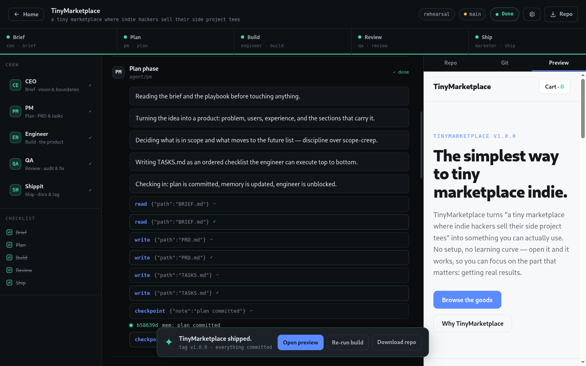
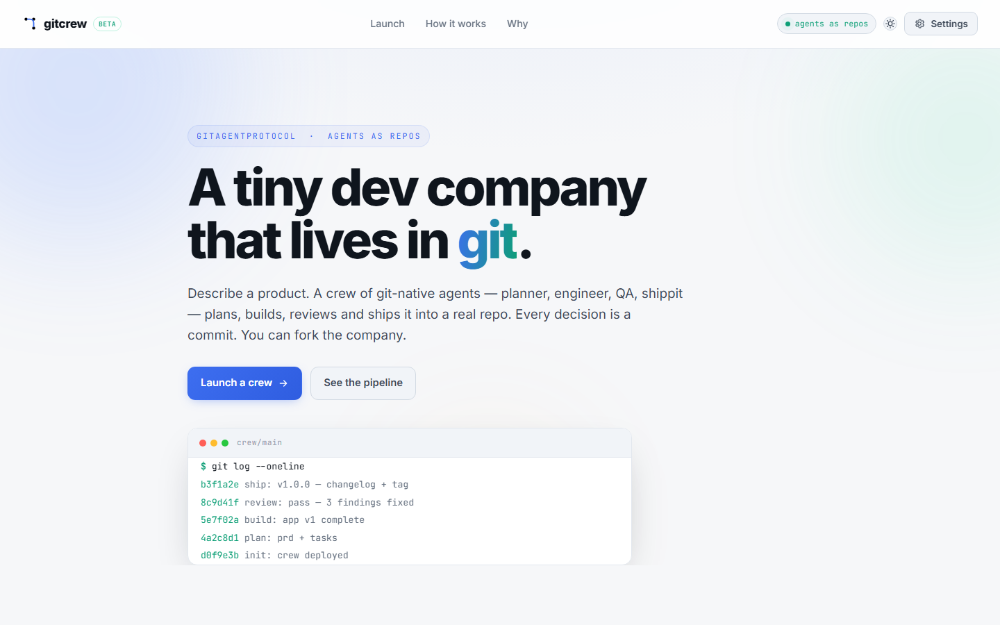
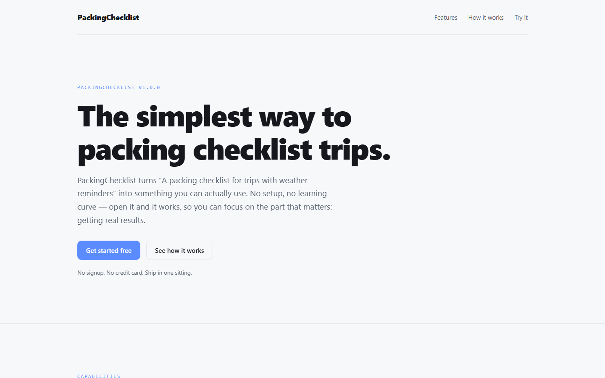

# gitcrew — a tiny dev company that lives in git

Describe a product. A crew of **git-native agents** plans, builds, reviews and
ships it into a real git repository — every decision a commit, the memory
`git log`-able, the company forkable.

Built on the [GitAgentProtocol (GAP)](https://www.gitagent.sh/) open standard:
the agent IS a repo. `SOUL.md`, `RULES.md`, `memory/`, `agents/`, `skills/`,
`workflows/`, `tools/`, `hooks/` — all versioned files.

> **Try the live demo:** [https://digvijaybind.github.io/gitcrew/](https://digvijaybind.github.io/gitcrew/)
>
> Every product the crew ships is automatically published there — the URL is
> always the newest build.



## Screenshots

| The app — launch a build | The crew at work |
|---|---|
|  |  |

| Built product (preview) | Live site (auto-published) |
|---|---|
|  |  |

## What it does

1. You type a one-line product idea (and pick a stack + speed).
2. The app **deploys a crew** — a fresh git repo cloned from the
   `crew-template/` company definition, seeded with your brief.
3. Five specialists run in order, streaming live to the browser:

   | Phase | Agent | Deliverable |
   |-------|-------|-------------|
   | Brief | `ceo` | `BRIEF.md` — vision + boundaries |
   | Plan | `pm` | `PRD.md`, `TASKS.md` |
   | Build | `engineer` | `app/` — a real, self-contained product |
   | Review | `qa` | `REVIEW.md` + fixes |
   | Ship | `marketer` | `README.md`, `CHANGELOG.md`, tag `v1.0.0` |

4. You get a **repo** with real git history, a **preview** of the built
   product, and a **download**.

Every commit is real: `git log` on a finished workspace tells the whole story —
`init: crew deployed` → `plan:` → `build:` → `review:` → `ship:` → `v1.0.0`.

## Two modes

- **Rehearsal** — deterministic engine, no API key needed. Full pipeline, real
  files, real commits. Perfect for instant demos.
- **Live** — the GitAgent SDK (`query()` from `@open-gitagent/gitagent`) runs
  real LLM agents against the repo. Drop any provider key in Settings:
  OpenAI, Anthropic, Google, Groq, xAI, Mistral, or a self-hosted llama.cpp
  endpoint (the Qwen 3.6 35B uncensored model was used to build the live
  products hosted at the demo URL — see `server/models.js`).

## Why it's "agents as repos"

The core idea of GAP: your agent lives in a git repo, so you get versioning,
branching, forking, review and CI for free. `gitcrew` makes that tangible:

- **Fork the company.** `crew-template/` is a standalone git repo. Clone it and
  you own a company — change `SOUL.md` and you change its personality.
- **Branch a build.** The pipeline could be forked per idea.
- **`git log` the memory.** `memory/MEMORY.md` is appended and committed by
  every specialist via the `checkpoint` tool.
- **Diff the rules.** Rule changes are tracked like any code change.

## Architecture

```
gitcrew/
├── crew-template/            # the git-native company (a git repo)
│   ├── agent.yaml            # company manifest
│   ├── SOUL.md / RULES.md / DUTIES.md
│   ├── memory/MEMORY.md      # committed by checkpoints
│   ├── agents/<role>/        # sub-agents, each its own manifest + SOUL
│   ├── skills/<phase>/       # composable skill modules
│   ├── workflows/build.yaml  # the pipeline definition
│   ├── tools/*.yaml          # declarative tools (commit, checkpoint)
│   ├── hooks/hooks.yaml      # lifecycle hook (tool audit log)
│   └── knowledge/            # PRODUCT_PLAYBOOK.md — the design system
├── server/                   # Node HTTP + SSE orchestration
│   ├── index.js              # routes, static, preview, settings
│   ├── crew.js               # pipeline + event hub
│   ├── live.js               # GitAgent SDK engine (query per phase)
│   ├── rehearsal.js          # deterministic engine (no key)
│   └── gitshim.js            # promisified git
├── web/                      # hand-crafted SPA (no framework, no build)
│   └── index.html · styles.css · app.js
└── workspaces/<id>/repo/     # each launched crew (created at runtime)
```

### How the SDK is used (live mode)

`server/live.js` runs one `query()` per phase against the workspace repo:

```js
import { query } from "@open-gitagent/gitagent";

const gen = query({
  dir: repoDir,                 // the workspace IS the agent
  model: `${provider}:${model}`,
  prompt: phasePrompt,
  systemPrompt: composeSystemPrompt(role), // sub-agent SOUL + RULES + skill
  maxTurns: phase.maxTurns,
});
for await (const msg of gen) {
  // delta / assistant / tool_use / tool_result / system → SSE to the browser
}
```

Declarative tools (`tools/commit.yaml`, `tools/checkpoint.yaml`) are
auto-discovered from the repo, and hooks audit every tool call.

## Run it

```bash
# needs Node 18+, git
npm install                # server deps (includes @open-gitagent/gitagent)
node server/index.js       # → http://localhost:4173
```

For live mode, add a key in Settings (or env):
`OPENAI_API_KEY`, `ANTHROPIC_API_KEY`, `GEMINI_API_KEY`, `GROQ_API_KEY`, etc.

## Hosting

Every product the crew ships is **auto-published** to the live site:

> **https://digvijaybind.github.io/gitcrew/**

When a run finishes, the server syncs the newest product into the `gh-pages`
branch (via a `site-live` worktree) and pushes it — no manual steps, the live
URL is always the latest build. Configure the repo in `server/settings.json`
(`ghRepo`) and auth via `GH_TOKEN`/`GITHUB_TOKEN` env, `settings.ghToken`, or
whatever git credentials are already set up on the host.

The app itself can also be served behind a free tunnel for instant sharing —
first browser visit shows a one-time "bypass tunnel reminder" interstitial
(standard localtunnel anti-abuse), then the app loads normally:

```bash
scripts/dev.sh start       # run the server on :4173
scripts/tunnel.sh start    # public URL via localtunnel (url subcommand prints it)
```

## Product notes

- The inspector shows the **live repo tree** (nested + collapsible), a
  **syntax-highlighted file viewer**, a **git log** with tags, and an iframe
  **preview** of whatever the crew built.
- Rehearsal mode ships three product templates (landing / dashboard /
  storefront), selected from keywords in the idea — so even without an LLM key
  the preview is a real, working site.
- `GET /api/crews/:id/download` exports the whole repo (with history) as a
  `.tgz`.

## License

MIT. The company is hiring.
